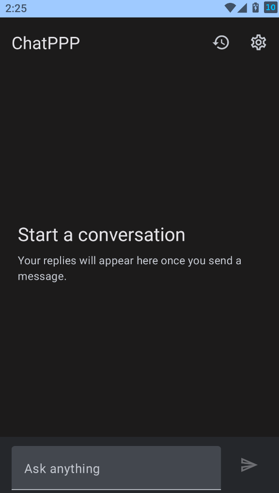
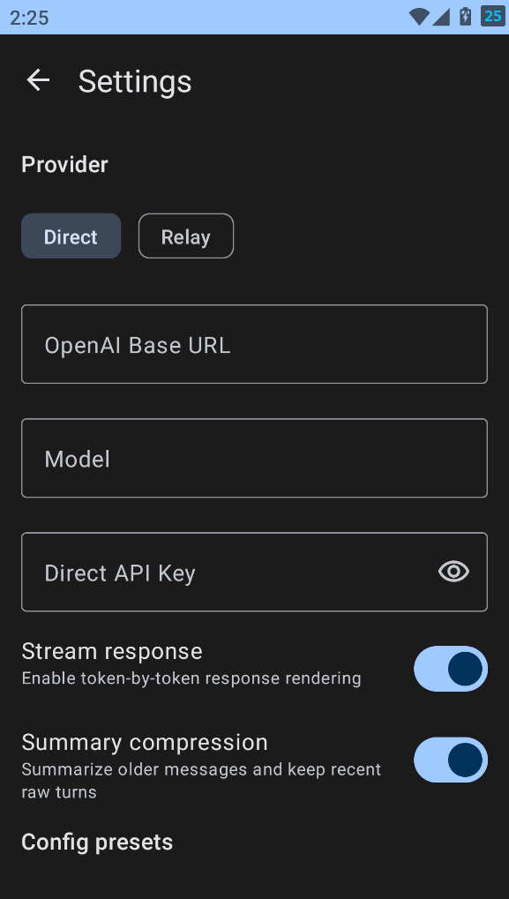
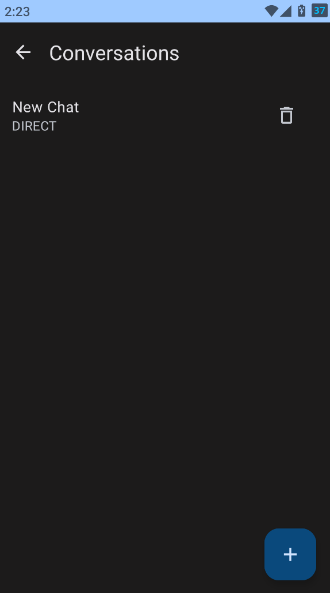

# ChatPPP

ChatPPP is a native Android AI chat client built with Kotlin and Jetpack Compose. The current repo focuses on a usable `Direct API` workflow for OpenAI-compatible endpoints, while keeping `Relay` as a reserved client-side extension path for a future user-owned backend.

## Project Scope

- Native Android client based on `Compose + ViewModel + Repository`
- OpenAI-compatible `chat/completions` requests with SSE streaming support
- Local conversation persistence, runtime settings, encrypted secret storage, and reusable config presets
- Long-conversation handling with token-budget-based summary compression
- Hidden-by-default reasoning blocks for providers that emit thinking content

## Core Capabilities

- Multi-turn chat with streaming, stop generation, retry, empty states, and readable error bubbles
- Conversation list and last-session recovery
- Settings for provider mode, base URL, model, streaming, and summary compression
- Conversation-level preset binding so different chats can use different direct API configurations
- Token-budget context assembly that preserves complete recent turns before sending requests

## Screenshots

### Chat screen

Shows the main conversation surface with streamed responses, preset binding, and the Compose-based chat layout.



### Settings screen

Shows direct-mode runtime configuration, secure API-key entry, streaming control, and summary-compression settings.



### Conversation list

Shows locally persisted conversations with quick switching, deletion, and new-conversation entry points.



## Architecture Notes

### 1. UI and state flow

The app uses `Jetpack Compose + StateFlow + ViewModel` for the chat screen, conversation list, and settings screen. UI events stay thin and flow into ViewModels, while repository streams drive message updates, retry state, and streaming progress.

### 2. Provider abstraction

`ChatProvider` hides transport details behind a common interface. `DirectApiProvider` is the primary runtime path and sends OpenAI-compatible requests to a user-configured base URL. `RelayApiProvider` is still present as a reserved client adapter, but this repository does not implement the backend relay service itself.

### 3. Persistence and secrets

`Room` stores conversations, messages, and conversation summaries. `DataStore` stores runtime settings and preset metadata. `EncryptedSharedPreferences` stores direct API keys and relay tokens. This split keeps frequently changing chat state, lightweight preferences, and secrets in the right storage layers.

### 4. Context management

Long conversations are handled with a token-budget model instead of message-count trimming. The current defaults are:

- `maxContextTokens = 32768`
- `compressionTriggerTokens = 24576`
- `targetCompressedTokens = 14336`
- `reservedResponseTokens = 6144`

When the estimated request stays under the trigger line, the app replays raw conversation history directly. When the estimate exceeds the trigger line, the repository refreshes a rolling summary and rebuilds the request so recent complete turns are preserved while older context is compressed.

### 5. Reasoning and response handling

The stream parser separates normal answer text from optional `reasoning_content`. The repository stores them independently, and the UI keeps reasoning hidden by default so the main answer stays readable. Blank assistant responses are treated as invalid follow-ups instead of being replayed as successful context.

## Direct and Relay Modes

- `Direct`: the client talks to an OpenAI-compatible endpoint with a user-supplied API key
- `Relay`: a reserved client-side compatibility path for a future backend relay

The current project phase prioritizes `Direct` end-to-end usage. Relay remains intentionally paused at the client-reserved stage: the Android client keeps the abstraction, request contract, and validation UX, but this repository does not include a relay backend service. See [docs/superpowers/specs/relay-backend-contract.md](docs/superpowers/specs/relay-backend-contract.md).

Example configuration:

- `Direct` base URL: `https://api.openai.com/v1`
- `Relay` base URL: `https://your-backend.example.com/v1` when a separate backend project exists
- `Relay` token: issued by your backend, not by the upstream model provider

## Local Setup

Requirements:

- JDK 17
- Android SDK with API 34
- Android Studio Hedgehog or newer recommended
- An emulator or connected device for instrumentation checks

From the project root:

```powershell
.\gradlew.bat assembleDebug
```

If local `adb` cannot bind to its default server port, you can use an alternate server port by replacing `<adb-server-port>` with a free local port:

```powershell
cmd /c "set ANDROID_ADB_SERVER_PORT=<adb-server-port>&& gradlew.bat connectedDebugAndroidTest"
```

## Verification

General verification:

```powershell
.\gradlew.bat lint
.\gradlew.bat testDebugUnitTest
.\gradlew.bat assembleDebug
```

Focused instrumentation examples:

```powershell
cmd /c "set ANDROID_ADB_SERVER_PORT=<adb-server-port>&& gradlew.bat connectedDebugAndroidTest -Pandroid.testInstrumentationRunnerArguments.class=com.chatppp.app.ui.chat.ChatScreenTest"
cmd /c "set ANDROID_ADB_SERVER_PORT=<adb-server-port>&& gradlew.bat connectedDebugAndroidTest -Pandroid.testInstrumentationRunnerArguments.class=com.chatppp.app.ui.settings.SettingsScreenTest"
cmd /c "set ANDROID_ADB_SERVER_PORT=<adb-server-port>&& gradlew.bat connectedDebugAndroidTest -Pandroid.testInstrumentationRunnerArguments.class=com.chatppp.app.navigation.ChatPppNavigationTest"
```

Fresh verification recorded on `2026-03-17` in this workspace:

- `.\gradlew.bat testDebugUnitTest assembleDebug` passed
- `app/build/reports/tests/testDebugUnitTest/index.html` reports `63 tests`, `0 failures`, `0 ignored`
- `cmd /c "gradlew.bat connectedDebugAndroidTest --rerun-tasks -Pandroid.testInstrumentationRunnerArguments.class=com.chatppp.app.ui.settings.SettingsScreenTest"` passed on a local emulator
- `app/build/reports/androidTests/connected/debug/index.html` reports `4 tests`, `0 failures`, `0 skipped`

## Current Limitations

- Relay mode is intentionally paused at the client-reserved stage; no backend relay service is implemented in this repo
- Live end-to-end direct API smoke still depends on valid local API credentials
- Summary compression quality depends on the configured model because older context is summarized before replay
- File upload, image input, and auth flows are deferred

## Current Stage

This project is no longer a shell-only prototype. The direct API MVP is functionally complete enough for local usage, regression verification, and interview discussion. The remaining work is mostly productization and packaging: broader instrumentation coverage, final documentation polish, and resume-facing project framing.
